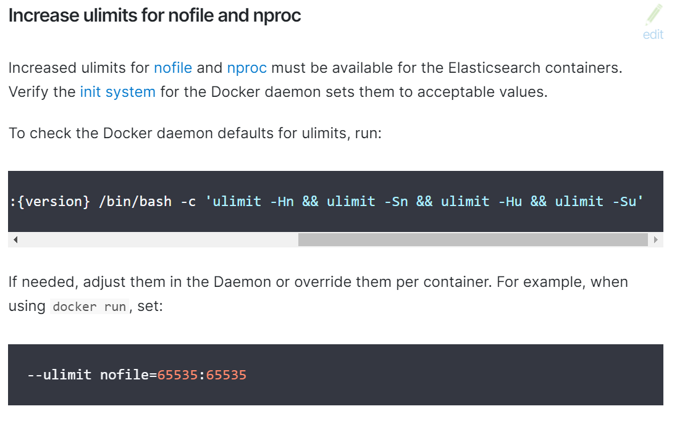

#### elasticsearch docker-compose yaml 文件源码鉴赏

官方链接：https://www.elastic.co/guide/en/elasticsearch/reference/7.17/docker.html
左上角可以切换版本

* 架构--极简架构yaml版本、服务、存储卷、网络

   

* ulimits--打开文件句柄数--Linux主机limits.conf文件

  参考链接：
  [linux - Meaning of the values for ulimit memlock flag - Unix & Linux Stack Exchange](https://unix.stackexchange.com/questions/449595/meaning-of-the-values-for-ulimit-memlock-flag)

  [如何在Docker内部使用ulimit——如何在docker内部生成core-阿里云开发者社区 (aliyun.com)](https://developer.aliyun.com/article/672996)

  

* 小结
  基于elastic的docker网络es01 es02 es03组建了一个集群
  通过ES_JAVA_OPTS对每个es节点的jvm进行控制
  解除内存相关限制ulimits--memlock值为-1，防止jvm出现内存相关问题，容器启动使用了相关参数bootstrap.memory_lock=true

  调整vm.max_map_count的大小，max_map_count文件包含限制一个进程可以拥有的VMA(虚拟内存区域)的数量，查看系统该值sysctl -a | grep vm.max_map_count
  

* 源码

  ```
  version: '2.2'
  services:
    es01:
      image: docker.elastic.co/elasticsearch/elasticsearch:7.17.13
      container_name: es01
      environment:
        - node.name=es01
        - cluster.name=es-docker-cluster
        - discovery.seed_hosts=es02,es03
        - cluster.initial_master_nodes=es01,es02,es03
        - bootstrap.memory_lock=true
        - "ES_JAVA_OPTS=-Xms512m -Xmx512m"
      ulimits:
        memlock:
          soft: -1
          hard: -1
      volumes:
        - data01:/usr/share/elasticsearch/data
      ports:
        - 9200:9200
      networks:
        - elastic
    es02:
      image: docker.elastic.co/elasticsearch/elasticsearch:7.17.13
      container_name: es02
      environment:
        - node.name=es02
        - cluster.name=es-docker-cluster
        - discovery.seed_hosts=es01,es03
        - cluster.initial_master_nodes=es01,es02,es03
        - bootstrap.memory_lock=true
        - "ES_JAVA_OPTS=-Xms512m -Xmx512m"
      ulimits:
        memlock:
          soft: -1
          hard: -1
      volumes:
        - data02:/usr/share/elasticsearch/data
      networks:
        - elastic
    es03:
      image: docker.elastic.co/elasticsearch/elasticsearch:7.17.13
      container_name: es03
      environment:
        - node.name=es03
        - cluster.name=es-docker-cluster
        - discovery.seed_hosts=es01,es02
        - cluster.initial_master_nodes=es01,es02,es03
        - bootstrap.memory_lock=true
        - "ES_JAVA_OPTS=-Xms512m -Xmx512m"
      ulimits:
        memlock:
          soft: -1
          hard: -1
      volumes:
        - data03:/usr/share/elasticsearch/data
      networks:
        - elastic
  
  volumes:
    data01:
      driver: local
    data02:
      driver: local
    data03:
      driver: local
  
  networks:
    elastic:
      driver: bridge
  ```

  